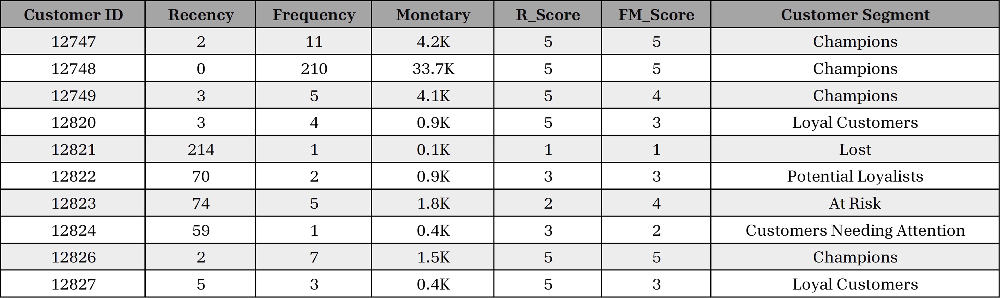

# Online-Retail-Data-Analysis-using-Analytical-SQL
This project aims to analyze the data of an Online Retail to gather some insights and make decisions depending on the Products Popularity, Profitability, Customer Segmentation, and some other metrics using Analytical SQL such as Window Functions, CTEs ... etc.

## RFM Model & Customer Segmentation ##

### About the RFM Model ###

__RFM__ or *Receny*, *Frequency*, *Monetary* __Model__ is a strategy for analyzing and estimating the value of a customer based on three data points:

- __Recency__ &rarr; How recently did the customer make a purchase ?
- __Frequency__ &rarr; How often do they purchase ?
- __Monetary__ &rarr; How much do they spend ?

These three factors can be used to reasonably predict how likely (or unlikely) it is that a customer will re-purchase from a company.

### How to Calculate RFM ###

After calculting the *Recency*, *Frequency*, and *Monetary*, customers are classified with a numerical ranking for each of the three values, with the ideal customer earning the highest score in each of the three categories. Here, the three values are on a scale of 1-5.

### Customer Segmentation ###

After getting the three scores, *R_Score*, *F_Score*, and *M_Score*. Our customers can be divided into segments according to the values of those scores. Here, I've divided the customers on only 2 values *R_Score*, and the average value of *F_Score* and *M_score* which is the *FM_Score*.

### Results ###

Here is a snapshot of the customer segments results from the RFM Analysis.

  
  
<em>Customer Segmentation according to RFM Model</em>

---