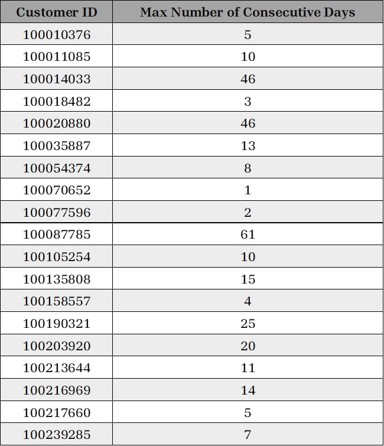
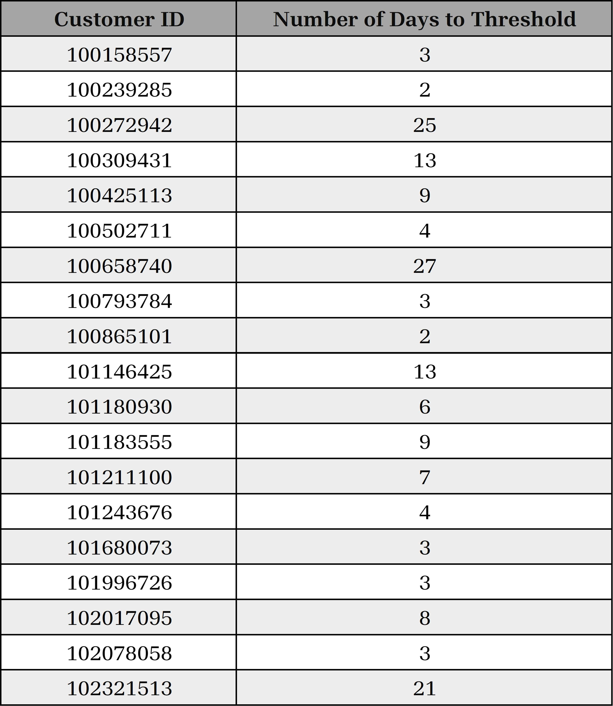

# Online-Retail-Data-Analysis-using-Analytical-SQL
This project aims to analyze the data of an Online Retail to gather some insights and make decisions depending on the Products Popularity, Profitability, Customer Segmentation, and some other metrics using Analytical SQL such as Window Functions, CTEs ... etc.

## Customers Purchasing Behavior ##

### Consecutive Purchasing Days for each Customer ###

Having a dataset with the purchasing dates and amount spent for each customer helps our retail store to track the customers behavior in purchasing our products. One of the KPIs which helps us is the number of consecutive purchasing days of each customer. The customers who but regularly from our retail store are so valuable and we need to care about them.

You can check the dataset from here &rarr; [Daily Purchasing Dataset](datasets/daily-purchasing.csv)

Using *Analytical SQL* and *Window Functions*, it's easy to track the consecutive days through `LAG` function to get each previous purchasing day and compare the results with the actual previous days in calender. This results in getting multiple number of consecutive days per customer, but getting the maximum of them is easier using `MAX` function.

You can check the whole code from here &rarr; [Tracing Customers Purchasing Behavior](codes/CustomersPurchasingBehvior.sql)

  
  
<em>Sample of the Maximum Consecutive Days of some Customers</em>

---

### Average number of days for reaching a specific threshold ###

We're interested in getting the average number of days/transactions over all customers to reach a spent threshold of 250 LE. This value differs from customer to customer depending on the number of times they purchased, and the total amount spent for each order. Besides, there're some customers who didn't reach this threshold.

After performing some calculations using *Analytical SQL*, I've found that, on average, the number of days/transactions customers made to reach this threshold is `7` days/transactions.

You can check the whole code from here &rarr; [Average Number of Days to reach a Threshold](codes/NumberOfDaysToThreshold.sql.sql)

  
  
<em>Random sample of the number of days/transactions made to reach a threshold of 250 LE</em>

