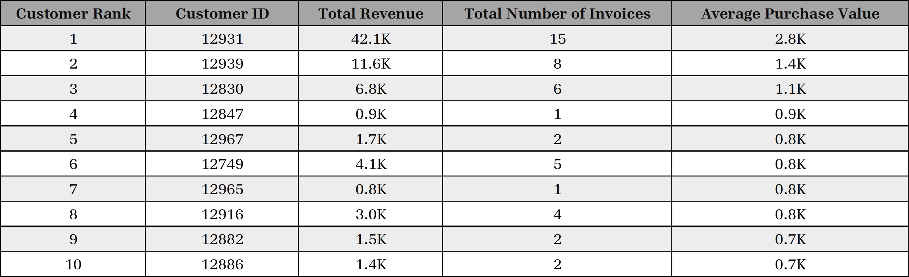
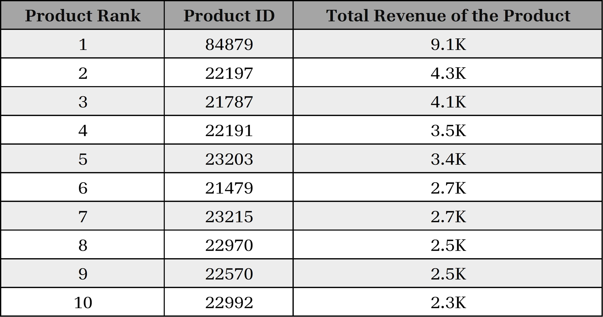

# Online-Retail-Data-Analysis-using-Analytical-SQL

This project aims to analyze the data of an __Online Retail__ to gather some insights and make decisions based on *Products Popularity*, *Products and Customers Profitability*, *Customer Segmentation*, and some other metrics using __Analytical SQL__ such as *Window Functions*, *CTEs* ... etc.

The data is visualized through various charts to add more clearness to the insights and understand sales trends and uncover potential opportunities for growth.

---

## Data Exploration ##

As the data exploration phase is one of the most important phases of any data analytics project, so let's start with. This phase made me understand the aspects of our retail data such as the size of data, the number of customers that purchased in a specified period, the year we're trying to analyze its data, and the products that are included in this analysis.

*After some exploration, I've concluded that:*
1. Total number of records is `12858`.
2. Our customer network has `110` customers.
3. The total number of products sold are `2335` products.
4. We're interested in only one country which is `United Kingdom`.
5. Our period of interest is between `Jan 11, 2011` and `Sept 9, 2011`.
6. `717` invoices have been made by different customers.

---

## Guiding Questions ##

The purpose of this analysis is to answer some major questions to help move the business in the right direction.

### Seasonal Trends and QoQ ###

As a retial store, we're interested to view the revenue data for each month for the year `2011`. Also, it's beneficial to understand and dig deeper into the *Seasonal Trends*.

So, we've aggregated the total revenue for each month in the year `2011` and shown the corresponding quarter. The data is sorted by total revenue in descending order partitioned by quarter.

  
  
<em>Total Revenue Per Month</em>

Besides, we've decided to dig deeper into the behavior of the revenue for each quarter and measure the *Quarter on Quarter* metric which represents the rate of change between quarterly fiscal data. It helps in determining the store's quarterly growth.

  
  
<em>Quarter on Quarter %</em>

---

### Average Purchase Value of Customers ###

As a retail store which helps thousands of customers to get their products, we're interested in viewing some information on the top 10 customers by revenue. This information shows the rank of each customer based on the `Average Puchase Value`, the total revenue he/she helps us to earn, and the total number of invoices he/she has made.

This helps us to define the top 10 customers who participated in our growth, and make a decision to invest in those customers.

  
  
<em>Average Purchase Value Per Customer</em>

---

### Products Popularity and Profitability ###

It's very important for any retail store to gain insights on the demand for their products. Two of the most important KPIs that determines this aspect is *Product Popularity* and *Product Profitability*.

*Product Popularity* defines the items that are selling well, in other words they're the best sellers.

  
  
<em>Best Sellers of our Online Retail Store</em>

On the other hand, *Product Profitability* determines the amount of profit that each product makes in a particular period.

  
  
<em>Products Profitability</em>

---

## RFM Model & Customer Segmentation ##

### About the RFM Model ###

__RFM__ or *Receny*, *Frequency*, *Monetary* __Model__ is a strategy for analyzing and estimating the value of a customer based on three data points:

- __Recency__ &rarr; How recently did the customer make a purchase ?
- __Frequency__ &rarr; How often do they purchase ?
- __Monetary__ &rarr; How much do they spend ?

These three factors can be used to reasonably predict how likely (or unlikely) it is that a customer will re-purchase from a company.

### How to Calculate RFM ###

After calculting the *Recency*, *Frequency*, and *Monetary*, customers are classified with a numerical ranking for each of the three values, with the ideal customer earning the highest score in each of the three categories. Here, the three values are on a scale of 1-5.

### Customer Segmentation ###

After getting the three scores, *R_Score*, *F_Score*, and *M_Score*. Our customers can be divided into segments according to the values of those scores. Here, I've divided the customers on only 2 values *R_Score*, and the average value of *F_Score* and *M_score* which is the *FM_Score*.

### Results ###

Here is a snapshot of the customer segments results from the RFM Analysis.

  
  
<em>Customer Segmentation according to RFM Model</em>

